# 图标向量化搜索应用初始化流程

## 1. 整体流程概览

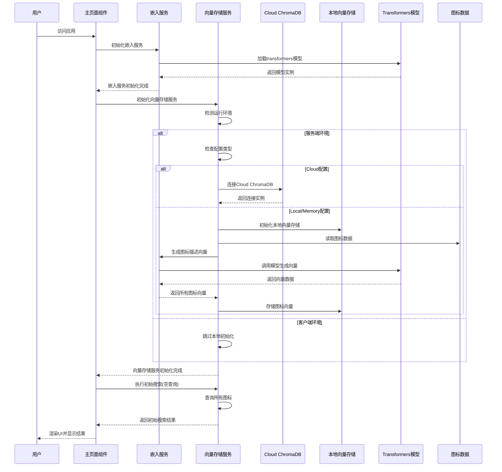

## 2. 详细初始化步骤

### 2.1 应用启动阶段

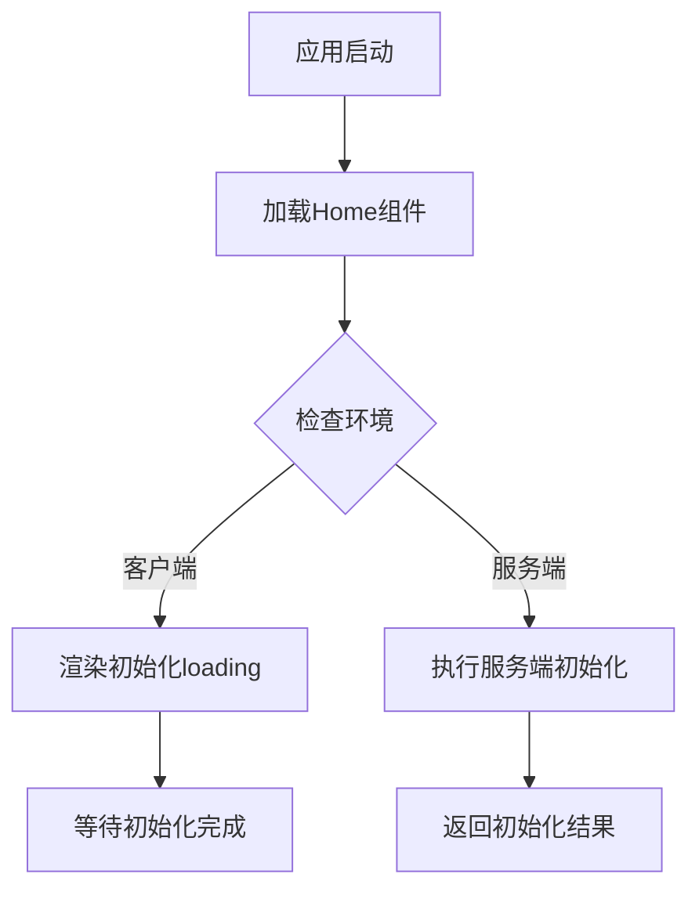

### 2.2 嵌入服务初始化流程

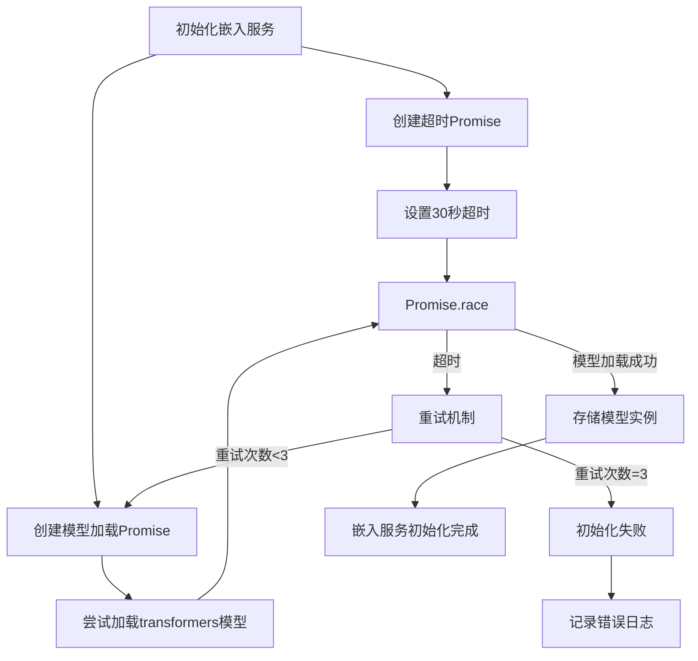

### 2.3 向量存储服务初始化流程

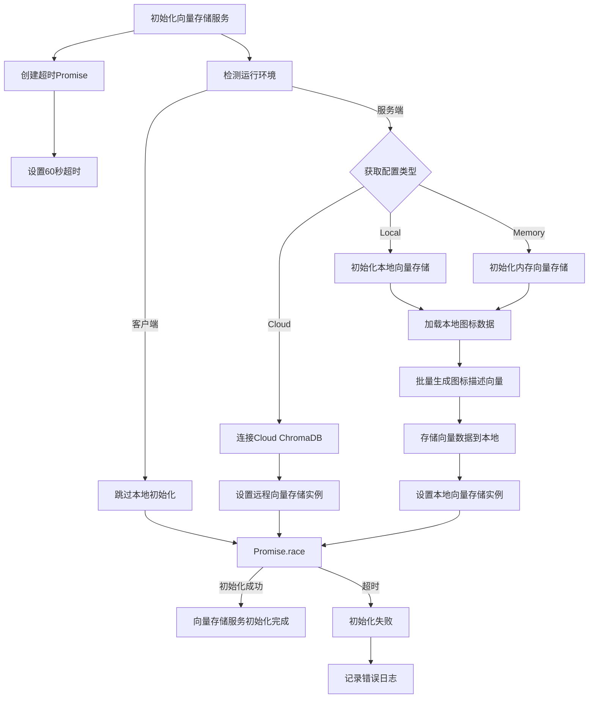

### 2.4 初始搜索与UI渲染流程

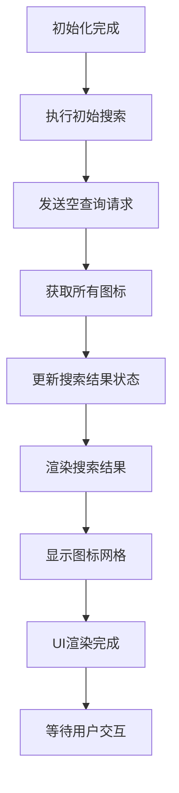

## 3. 关键技术点与处理策略

### 3.1 超时处理机制

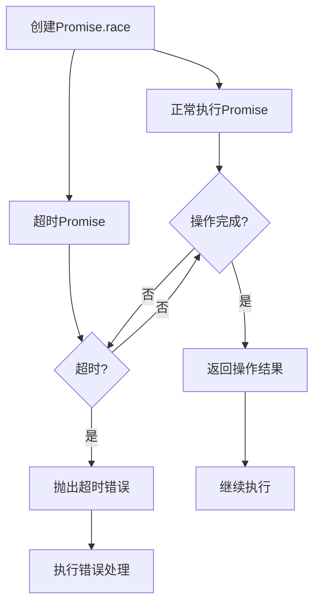

### 3.2 环境检测与适配

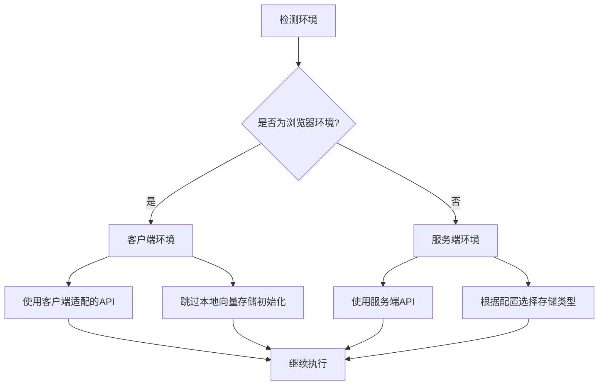

### 3.3 错误处理与降级策略

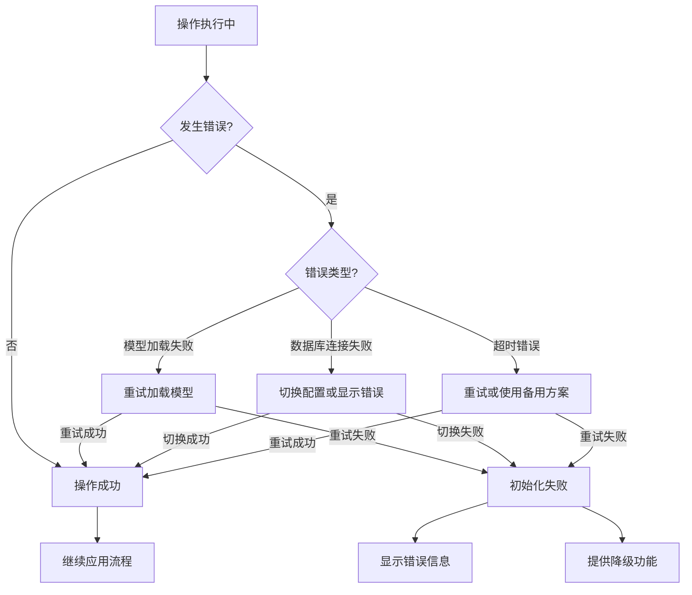

## 4. 关键代码位置

- **嵌入服务初始化**: `/app/services/embedding.ts` - `initialize()` 方法
- **向量存储初始化**: `/app/services/chroma.ts` - `initialize()` 方法
- **主页面初始化**: `/app/page.tsx` - `useEffect` 钩子
- **环境检测**: `/app/services/chroma.ts` - `isBrowser()` 方法
- **超时处理**: `/app/services/embedding.ts` 和 `/app/services/chroma.ts` 中的 `Promise.race` 实现

## 5. 性能优化措施

### 5.1 并行初始化

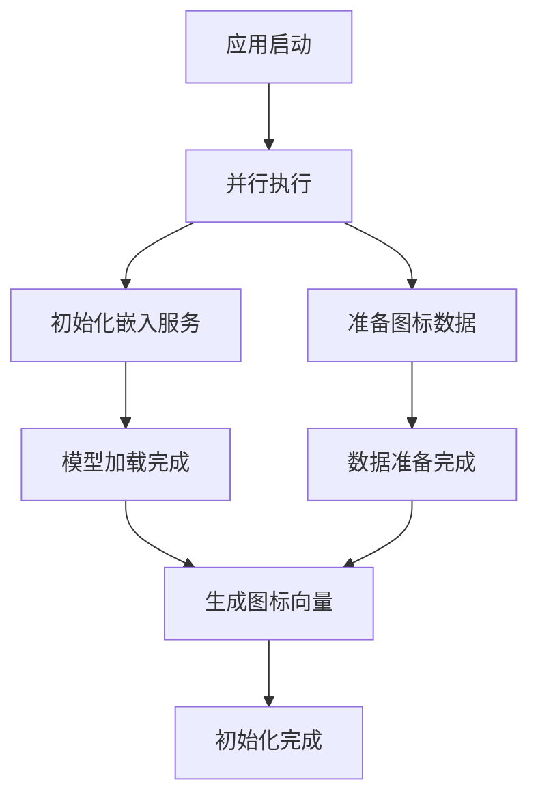

### 5.2 批量处理

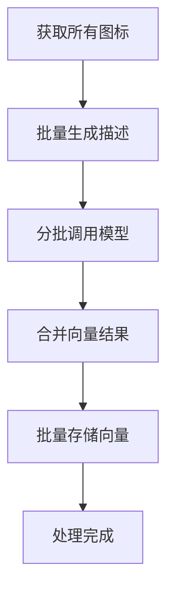

## 6. 潜在问题与解决方案

| 问题 | 解决方案 | 实现位置 |
|------|----------|----------|
| 模型加载超时 | 30秒超时+3次重试机制 | `/app/services/embedding.ts` |
| 向量存储初始化超时 | 60秒超时处理 | `/app/services/chroma.ts` |
| 客户端跨域问题 | 服务端API代理 | `/app/api` 路由 |
| 内存占用过高 | 分批处理+GC优化 | `/app/services/chroma.ts` |
| 并发请求冲突 | 状态锁+队列处理 | `/app/services/chroma.ts` |

## 7. 初始化状态管理

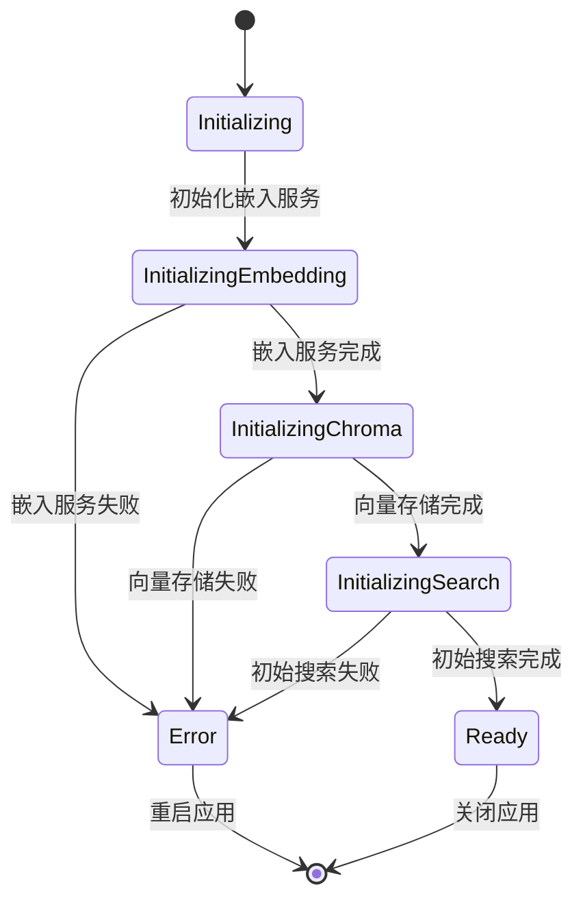

通过以上流程，应用能够在不同环境下稳定初始化，并处理各种异常情况，确保用户能够正常使用图标搜索功能。