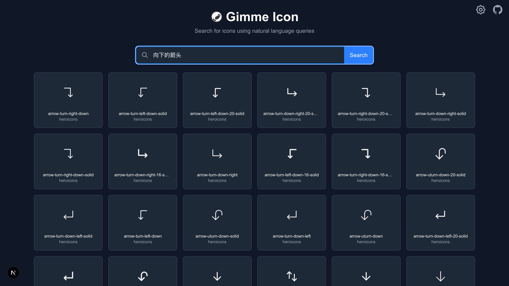

# Gimme Icon

**基于自然语言的图标搜索引擎。**

告别记忆图标名称！用 "一个向下的箭头" 这样的自然语言描述，迅速找到你想要的图标。

[](https://gimme-icon-next.vercel.app) [](LICENSE)



## ✨ 为什么需要 Gimme Icon？

现有的图标平台（如 Iconify、Heroicons）要求你**知道图标的确切名称或关键词**：

- 想找“搜索”图标？你得输入 `search`。
- 想找“用户头像”？你得知道它叫 `user` 或 `account`。

但现实中，你在寻找一个图标时，第一时间冒出的形容词为：
- “向下的箭头”
- “代表删除的垃圾桶图标”
- “带加号的房子”

**Gimme Icon 让你像说话一样搜索图标**——无需记忆命名规范，语义理解直达结果。

## 功能特性

- ✅ **自然语言搜索**：输入描述性语句，AI 理解意图并匹配图标
- 🧩 **聚合多图标库**：默认支持 Heroicons、Lucide，可扩展至 Iconify 全量图标集（200+ 库）
- 🛡️ **安全访问**：基于 GitHub OAuth 的登录认证，支持邮箱白名单控制台访问
- 🎛️ **控制台管理**：提供可视化后台，支持批量选择图标进行向量化处理
- 🚀 **现代技术栈**: 基于 Next.js 16 和 React 19 构建，支持服务端渲染
- 🌐 **开源 & 免费**：MIT 许可，可二次分发

## 🚀 快速体验

1. 访问在线 Demo 👉 [https://gimme-icon-next.vercel.app](https://gimme-icon-next.vercel.app)
2. 尝试搜索：
   - “向下的箭头”
   - “代表删除的垃圾桶图标”
   - “带加号的房子”

## 技术栈

- **前端框架**: Next.js 16（App Router） + React 19
- **UI 组件**: Shadcn UI + Tailwind CSS 4
- **认证方案**: Better-Auth (GitHub OAuth)
- **向量检索**:
  - 模型: `@huggingface/transformers` (all-MiniLM-L6-v2)
  - 数据库: ChromaDB
- **构建工具**: Turbopack
- **类型系统**: TypeScript 5
- **包管理器**: pnpm 10

## 快速开始

### Clone 仓库

```bash
git clone https://github.com/lexmin0412/gimme-icon.git
cd gimme-icon
```

### 环境要求

- Node.js >= 20
- pnpm >= 10

### 安装依赖

```bash
pnpm install
```

### 环境变量配置

复制 `.env.example` 到 `.env.local`：

```bash
cp .env.example .env.local
```

然后编辑 `.env.local` 填入你的配置信息（GitHub OAuth、Chroma Cloud、邮箱白名单等）。

### 启动开发服务器

```bash
pnpm dev
```

应用将在 `http://localhost:9588` 启动（端口可在 `package.json` 中修改）。

### 构建生产版本

```bash
pnpm build
pnpm start
```

## 项目结构

```
├── app/                  # Next.js App Router 应用目录
│   ├── api/              # API 路由 (auth, chroma, etc.)
│   ├── console/          # 控制台页面 (需权限)
│   ├── components/       # 通用组件
│   └── page.tsx          # 首页
├── components/           # UI 组件库 (shadcn/ui)
├── constants/            # 常量定义
├── context/              # React 上下文
├── libs/                 # 第三方库初始化 (auth, chroma)
├── public/               # 静态资源
├── services/             # 业务逻辑服务
│   ├── embedding.ts      # 向量化服务
│   └── icons.ts          # 图标数据服务
└── types/                # TypeScript 类型定义
```

## 许可证

MIT License

## 鸣谢

在开发和前期规划过程中，参考了以下项目进行设计：

- [Iconify](https://iconify.design)：提供海量图标库资源和 API
- [Simple Icons](https://github.com/simple-icons/simple-icons)
- [icones](https://github.com/antfu/icones)
