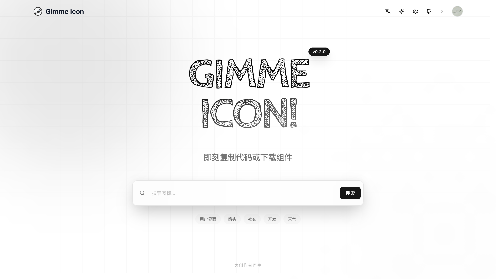
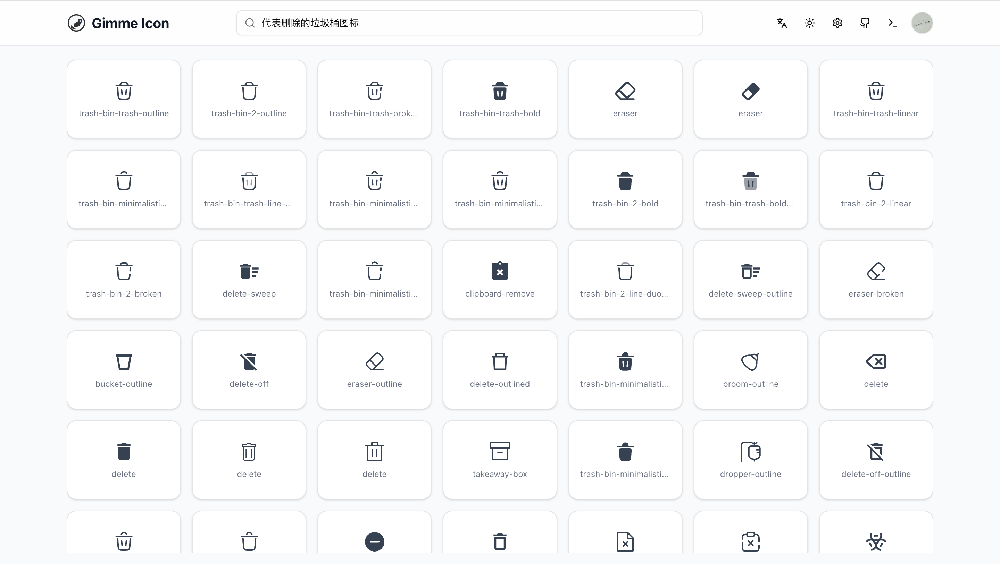

<div align="center">
  <h1 align="center">Gimme Icon</h1>

  <p align="center">
    <strong>语义化图标搜索引擎</strong>
  </p>

  <p align="center">
    基于 Next.js 16, React 19, Transformers.js 和 ChromaDB 构建。
  </p>

  <p align="center">
    <a href="https://gimme-icon-next.vercel.app"><strong>在线演示</strong></a> ·
    <a href="#功能特性"><strong>功能特性</strong></a> ·
    <a href="#技术栈"><strong>技术栈</strong></a> ·
    <a href="#快速开始"><strong>快速开始</strong></a> ·
    <a href="#一键部署"><strong>一键部署</strong></a>
  </p>

  <br/>

  <p align="center">
    <a href="./README.md">English</a> | 简体中文
  </p>

  [](https://gimme-icon-next.vercel.app)
  [](LICENSE)
</div>

<br/>



## ✨ 为什么选择 Gimme Icon？

传统的图标库（如 Iconify, Heroicons）迫使你**死记硬背关键词**。

- 想找"搜索"图标？你得输入 `search`。
- 想找"加号"图标？你得猜是叫 `add` 还是 `plus` 还是 `create`？

**Gimme Icon** 改变了这一切。直接描述你脑海中的画面：
- "一个向下的箭头"
- "代表删除的垃圾桶图标"
- "带加号的房子"

理解你的意图，而不仅仅是匹配关键词。



## 功能特性

- **语义化检索**：由 `@huggingface/transformers` (paraphrase-multilingual-MiniLM-L12-v2) 驱动，支持本地或边缘计算运行。
- **向量检索**：
  - **ChromaDB**：可切换至专业的向量数据库，支持生产级扩展。
- **海量图标库**：聚合了来自 Iconify 的 200+ 图标集，共计 20W+ 图标。
- **现代 UI/UX**：基于 Shadcn UI 和 Tailwind CSS 4 构建，提供美观、响应式的用户体验。
- **安全认证**：集成了 GitHub OAuth 安全认证 (Better-Auth)。
- **管理控制台**：可视化的后台管理系统，支持批量向量化处理。

## 技术栈

- **框架**: [Next.js 16](https://nextjs.org/) (App Router)
- **语言**: [TypeScript 5](https://www.typescriptlang.org/)
- **样式**: [Tailwind CSS 4](https://tailwindcss.com/) & [Shadcn UI](https://ui.shadcn.com/)
- **AI & 向量**:
  - [Transformers.js](https://huggingface.co/docs/transformers.js) 用于生成 Embeddings
  - [ChromaDB](https://www.trychroma.com/) 用于向量存储
- **认证**: [Better-Auth](https://www.better-auth.com/)
- **包管理**: [pnpm](https://pnpm.io/)

## 一键部署

你可以一键将 Gimme Icon 部署到 Vercel：

[](https://vercel.com/new/clone?repository-url=https%3A%2F%2Fgithub.com%2Flexmin0412%2Fgimme-icon&env=BETTER_AUTH_SECRET,BETTER_AUTH_URL,GITHUB_CLIENT_ID,GITHUB_CLIENT_SECRET)

## 快速开始

### 环境要求

- Node.js >= 20
- pnpm >= 10

### 安装步骤

1. **Clone 仓库**

   ```bash
   git clone https://github.com/lexmin0412/gimme-icon.git
   cd gimme-icon
   ```

2. **安装依赖**

   ```bash
   pnpm install
   ```

3. **配置环境变量**

   复制示例配置文件：

   ```bash
   cp .env.example .env.local
   ```

   编辑 `.env.local` 填入你的配置信息（认证服务必须配置，ChromaDB 可选）。

4. **启动开发服务器**

   ```bash
   pnpm dev
   ```

   访问 `http://localhost:9588`。

   > **注意**：首次启动时，应用会自动下载 Embedding 模型并为默认图标集生成向量索引。

### 构建生产版本

```bash
pnpm build
pnpm start
```

## 项目结构

```
├── app/                  # Next.js App Router 应用目录
│   ├── api/              # API 路由 (auth, chroma, etc.)
│   ├── console/          # 控制台页面 (需权限)
│   ├── components/       # 通用组件
│   └── page.tsx          # 首页
├── components/           # UI 组件库 (shadcn/ui)
├── constants/            # 常量定义
├── context/              # React 上下文
├── libs/                 # 第三方库初始化 (auth, chroma)
├── public/               # 静态资源
├── services/             # 业务逻辑服务
│   ├── embedding.ts      # 向量化服务
│   └── icons.ts          # 图标数据服务
└── types/                # TypeScript 类型定义
```

## 许可证

MIT License

## 鸣谢

- [Iconify](https://iconify.design) - 通用图标框架。
- [Lucide](https://lucide.dev/) - 美观一致的图标库。
- [Simple Icons](https://simpleicons.org/) - 流行品牌的免费 SVG 图标。
